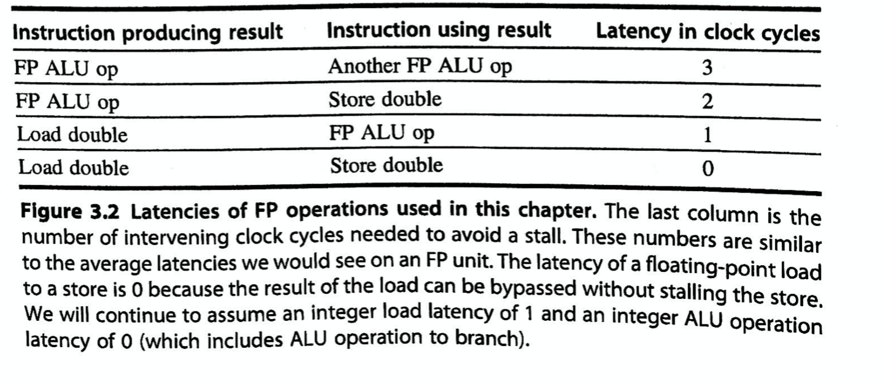
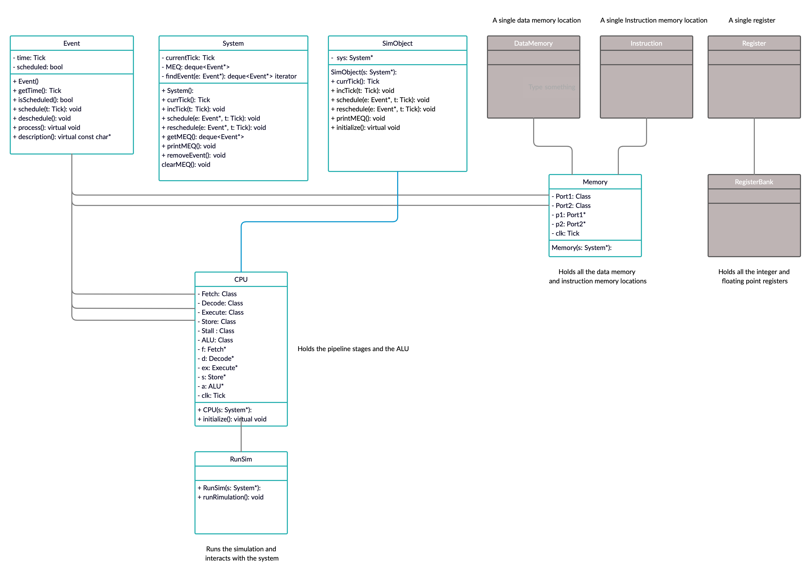

# Assignment 3

# Memory:

# Flow
- Convert the instructions into binary and place them into instruction memory. This is done in the setup simulation function.
- Add registers and other variable to hold an instruction in pipeline.
    - Store stage only needs the destination register.
    - Fetch just needs a variable to hold the instruction.
    - Decode breaks up the instruction and passes it to the execute.
- All the stages are done using a send and receive events.
    - Receive is triggered by the cpu when a stage needs to be run. This already done. Done on odd cycles.
    - Send is created when the stage is completed and needs to pass its data. To the next stage This is done on an even cycle.
- Stalls need to be implemented for the execution stage.

# Notes:
- A tab in the s file signifies an immediate value instruction
- .LBB0 is a branch
- Stager the pipeline operations.
- Cpu triggers the pipeline on an odd clock cycle and on an event.
- And on an even cycle the release event is called and passes the data to the next stage.
- Rising edge is odd cycle and even is falling edge. Implement this for all events.
- If execute is still processing reschedule release event for a future data and process stall.
- Dynamic cast will allow an event to be casted back to its original class from a base event. Example: Event back to Fetch.
- Hi  referes to the top 20 bits of memory address.
- Low referes to the bottom 12 bits of memory address.
- Don’t have to convert the asm to binary in the code but can do it by hand and insert into memory locations.
- Adding pthread should allow us to multithread some operations. Not sure if we are allowed to use this since it taps into the cpus threads.
- NOPs may be required while waiting for data to load from RAM, stalls may be required while waiting for data to store in RAM) [15]
- For rounding mode for fadd.s we chose 111 (dynamic rounding mode (see page 48 of riscv spec))
- JAL means Jump and Link
    - JAL address means ra <- PC+4; PC <- Address

# Example:
Ticks:
0 - setup simulation
1  - run first fetch stage
6 - send data to decode stage from fetch
11 - run decode and next fetch stage
12 - access the registers and place into decode
16 -  pass decode to execute and fetch to decode
21 - run execute, decode, fetch.
26  - If execute is done, then pass to store, pass decode to execute, and fetch to decode.

# Still need
- Part 1
    - Finish the pipeline data flow
        - Implement stalls and nops to handle hazards and latencies. Using stalls so I hope that works.
        - Implement the alu operations
    - Convert to C

    - The register access stalls the processor and reschedules events. make sure the rescheduled events times are a multiple of 11. Fix this

- Part 2
    - Implement Membus

